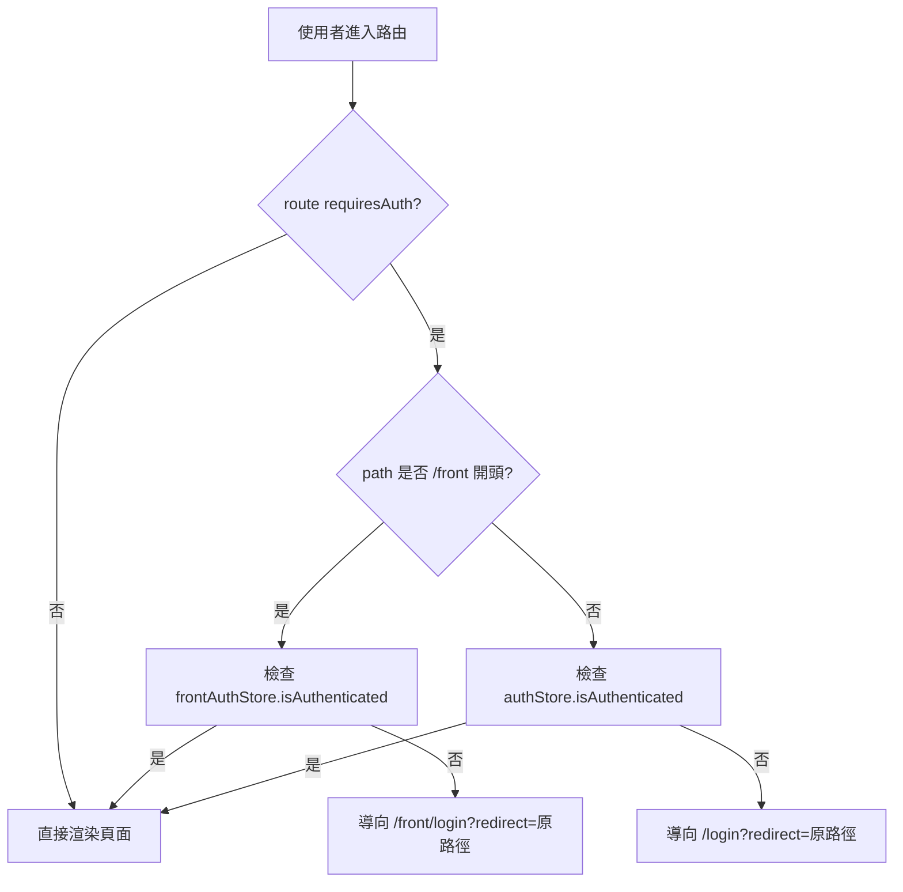
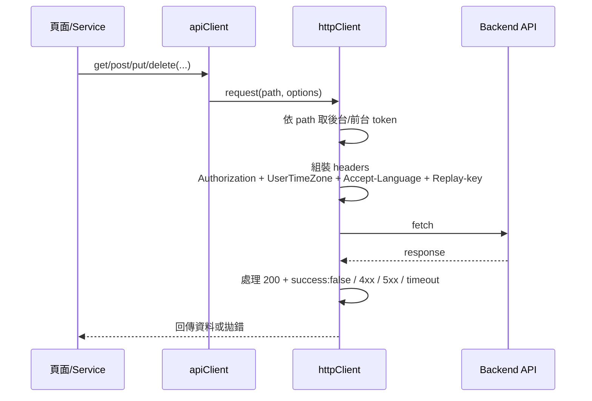

# 前端架構與請求流程

本文件描述 Brainwave 前端在「路由、版面、狀態、API 呼叫」上的整體運作，供開發與協作人員快速掌握主要資料流。

---

## 1. 架構總覽

- 路由由 `src/router/index.ts` 集中管理，公開區與受保護區共用同一套路由守衛。
- 畫面分成 `PublicLayout`（首頁/登入）與 `MainLayout`（後台主框架）。
- 狀態使用 Pinia（`auth`、`frontAuth`、`app`、`theme`、`i18n`、`loading`）。
- API 一律經 `apiClient -> httpClient -> fetch`，統一 token、業務 headers、錯誤處理。

---

## 2. 路由與授權流程

關鍵點：

- 判斷前台/後台是用 path 前綴（`/front`）區分。
- 未登入時會帶 `redirect`，登入後返回原頁。
- 路由載入錯誤時會導向 `/500`，確保錯誤情境有一致入口。

---

## 3. API 呼叫資料流

關鍵點：

- `path` 以 `/api/front` 開頭時，取前台 token；其他走後台 token。
- `success:false`（即使 HTTP 200）也會被視為錯誤拋出。
- 401 會清除對應 token 並導向登入；5xx 導向 `/500`。

---

## 4. 主要組件責任

- `router/index.ts`：路由表、`beforeEach` 授權守衛、`afterEach` 標題設定。
- `shared/services/httpClient.ts`：統一 HTTP 行為（headers、timeout、錯誤導頁、loading）。
- `shared/services/apiClient.ts`：對外薄包裝，維持呼叫端簡潔。
- `stores/auth.ts`、`stores/frontAuth.ts`：登入狀態、token、角色與基礎權限計算。

---

## 5. 變更規範（避免破壞）

- 新增受保護頁時，請在路由 `meta.requiresAuth` 明確標示。
- 新 API 優先補在 service 層，避免頁面直接呼叫 `fetch`。
- 若調整 token 規則，需同時檢查：
  - `auth/frontAuth store`
  - `httpClient` 取 token 邏輯
  - 登入頁跳轉邏輯
